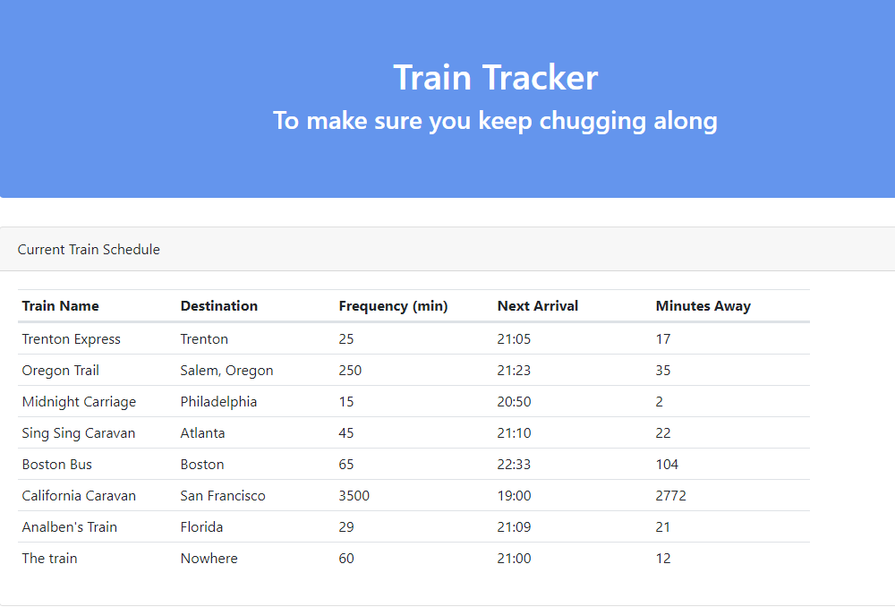

# Train-Tracker

This app uses Firebase and moment.js to track the interval of train arrivals.
You have the ability to add a new train to the database after giving it some information.

https://grimblelewis.github.io/Train-Tracker/